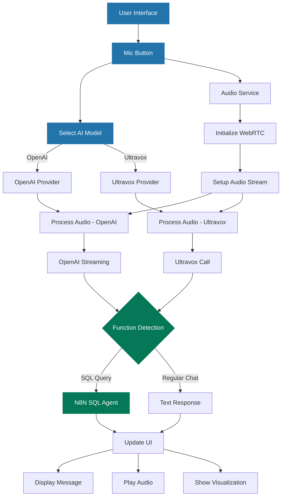

```mermaid
graph TD
    %% User Interface
    A[User Interface] --> B[Mic Button]
    B --> C[Select AI Model]
    
    %% AI Model Selection
    C -->|OpenAI| D1[OpenAI Provider]
    C -->|Ultravox| D2[Ultravox Provider]
    
    %% Audio Setup
    B --> E[Audio Service]
    E --> F[Initialize WebRTC]
    F --> G[Setup Audio Stream]
    
    %% Voice Processing Flow
    G --> H1[Process Audio - OpenAI]
    G --> H2[Process Audio - Ultravox]
    
    %% Provider Paths
    D1 --> H1
    H1 --> I1[OpenAI Streaming]
    D2 --> H2
    H2 --> I2[Ultravox Call]
    
    %% Function Detection
    I1 --> J{Function Detection}
    I2 --> J
    
    %% Query Processing
    J -->|SQL Query| K[N8N SQL Agent]
    J -->|Regular Chat| L[Text Response]
    
    %% Response Handling
    K --> M[Update UI]
    L --> M
    
    %% Output Streams
    M --> N1[Display Message]
    M --> N2[Play Audio]
    M --> N3[Show Visualization]
    
    %% Styling
    classDef primary fill:#2374ab,stroke:#2374ab,stroke-width:2px,color:#fff
    classDef secondary fill:#047857,stroke:#047857,stroke-width:2px,color:#fff
    
    class A,B,C primary
    class J,K secondary
```